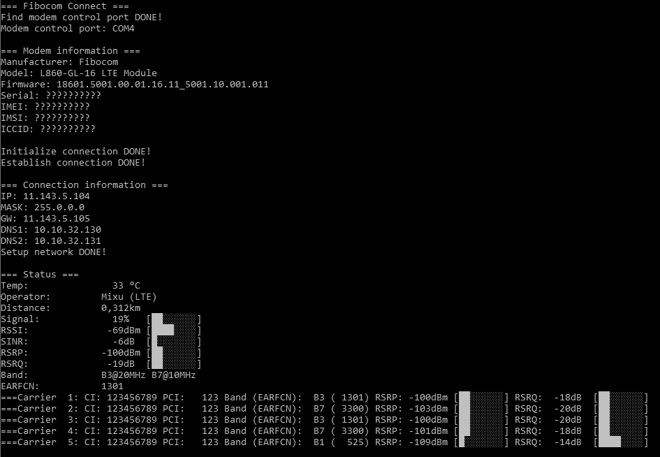

# Fibocom L8x0 Connect for Windows

## Run

All script **_must_** be run as administrator

- `connect.cmd`: Connect and monitoring
- `monitor.cmd`: Connection monitoring without connect

## Setup

#### APN

Edit `scripts/main.ps1` to configure your carrier APN, APN_USER and APN_PASS

#### Preferred bands

Find `AT+XACT=` in `scripts/main.ps1` and edit command to your needs
Example:

- UMTS+LTE all bands, LTE preferred: AT+XACT=4,2,,0
- LTE all bands: AT+XACT=2,,,0
- LTE 3 and 7 bands: AT+XACT=2,,,103,107

### Override DNS

Edit `scripts/main.ps1` to configure your DNS: DNS_OVERRIDE
